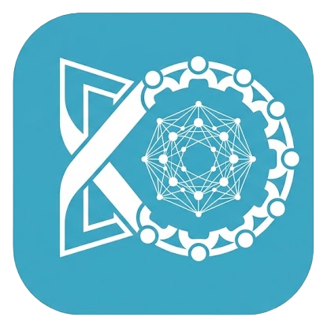

<p align="center">
  
</p>

<h1 align="center">Kelabo</h1>

<p align="center">
  Live rooms with transcription, an AI assistant that answers <em>into the meeting</em>,<br>
  minutes written for you, and a searchable archive of everything your team decided.
</p>

<p align="center">
  <a href="LICENSE"></a>
  <a href="docs/self-hosting.md"></a>
</p>

---

Each live room is a **kelabo** — not quite a call, not quite a meeting, its own
kind — and that is the word the app, the code and the URLs use. Open source,
MIT, self-hosted in your own AWS account.

## What you get

- **A live room** with conference audio, camera and screen share. Two
  transports: `sfu` (Cloudflare's edge, scales) or `mesh` — a "secure kelabo"
  where media stays peer-to-peer and **no server can decrypt it**.
- **Live transcription** as people speak, streamed browser → Deepgram directly:
  the server receives transcripts, never audio.
- **Messages beside the transcript** — the room's chat, with history that
  survives leaving and re-entering, day dividers when a room outlives a day,
  and paging back through weeks of it.
- **An assistant in the room.** A main agent listens to the whole conversation
  and, when the room needs something, dispatches sub-agents to search — web,
  MCP, code — then posts a concise answer to the kelabo's shared board. Address
  it directly with `@kelabo`.
- **Minutes, written for you.** When a kelabo ends it is archived — transcript,
  board and generated minutes — and becomes a searchable record.
- **Bring your own coding agent.** `npm i -g @kelabome/agents` attaches your
  own opencode or Claude Code session to a kelabo: it hears the transcript,
  answers onto the board, and every permission prompt stays in *your* terminal.
  Kelabo never runs your agent — it hands it a channel. See
  [connector/README.md](connector/README.md).
- **Everything optional degrades, nothing jams.** No Deepgram key? The room is
  typed messages and calls. No LLM? No assistant surface at all — not a broken
  one. No Cloudflare creds? Peer-to-peer calling still works. The capability
  ladder is a design rule, not an accident:
  [docs/19-optional-capabilities.md](docs/19-optional-capabilities.md).

## How it is put together

| Piece | What it is | Docs |
|---|---|---|
| `spa/` | The web app — room, board, records. React + Vite, served from CloudFront | [01-spa](docs/components/01-spa.md) |
| `gateway/` | The live half: SSE fan-out, captions, calls, the in-room agent. Node on ECS Fargate | [03-gateway](docs/components/03-gateway.md) |
| `rest-api/` | The control plane: auth, kelabos, records, scheduling. Lambda | [02-rest-api](docs/components/02-rest-api.md) |
| `connector/` | The agent bridge — one package, one `kelabo` command, every runtime | [16-agent-bridge](docs/components/16-agent-bridge.md) |
| `contracts/` | Shared schemas and wire shapes; everything speaks these | [10-data-contracts](docs/10-data-contracts.md) |
| `infra/` | The whole deployment as CDK stacks | [07-cdk-infra](docs/components/07-cdk-infra.md) |

The architecture overview lives in [ARCHITECTURE.md](ARCHITECTURE.md); the
numbered design docs under [docs/](docs/) go deep on each subsystem —
transcript lifecycle, agent orchestration, conference RTC, data flows.

## The five-minute tour

```bash
make bootstrap        # npm install in every package
make test             # every package's test suite, no AWS needed
make help             # everything is a make target
```

## Deploying for real

You need an AWS account, a Route 53 domain, and API keys for Deepgram
(transcription) and an LLM provider (assistant + minutes). The
[self-hosting guide](docs/self-hosting.md) walks from an empty account to
`kelabo.mycompany.com`. Keys you skip just switch their capability off —
the deployment tells the app what it can run, and the app offers exactly that.

## License

[MIT](LICENSE).
